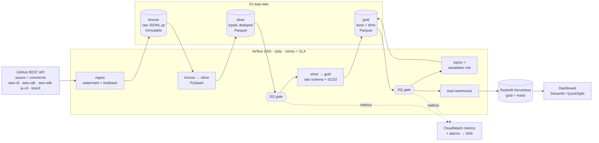
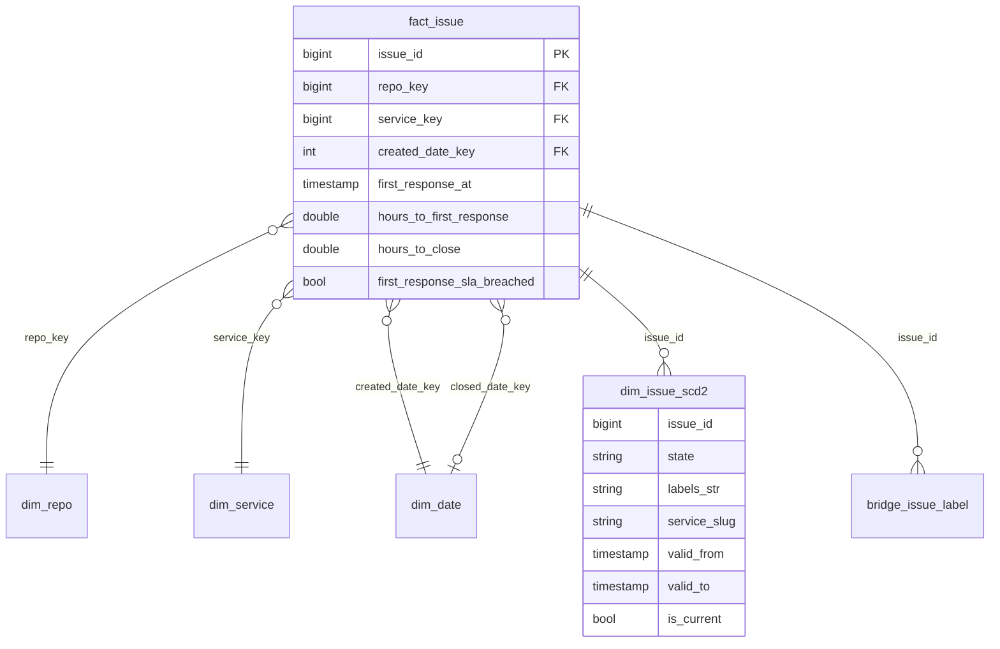

# AWS Customer Support Signals Lakehouse

An incremental data platform that treats public GitHub issues on AWS's SDK, CLI and CDK repos as **customer support cases**. It lands the raw data in S3, cleans and deduplicates it with Spark, models it as a star schema in Redshift, and gates every run on data quality checks.

The questions it answers are the ones a support organization asks: how quickly customers get a first response, where the backlog is growing, which AWS services generate the most repeat problems, and which new cases are likely to escalate.

`Python` · `PySpark / SparkSQL` · `AWS Glue` · `S3` · `Redshift Serverless` · `Airflow` · `Terraform` · `DuckDB` · `scikit-learn` · `GitHub Actions`

---

## Architecture



The same code runs in two places:

| | Local (free) | AWS |
|---|---|---|
| Storage | `./data` | `s3://…/lake` |
| Spark | local PySpark | AWS Glue 5.0 job |
| Warehouse | DuckDB | Redshift Serverless (Data API) |
| Orchestration | Airflow in Docker | Airflow triggering Glue (MWAA optional) |
| DQ alerts | JSON report | CloudWatch metrics → alarm → SNS email |

Switching between them is a config change (`SIGNALS_STORAGE_ROOT=s3://…`), not a code change.

## How it maps to a data engineering role

| Requirement | Where it lives |
|---|---|
| Incremental ETL pipelines | `src/signals/ingest/github_issues.py`: watermark, lookback window, at-least-once delivery, rate-limit handling |
| Spark / SparkSQL at scale | `src/signals/transform/silver.py`, `gold.py`: explicit schemas, window dedup, no Python UDFs |
| Data modeling / warehousing | `sql/redshift/ddl.sql`: star schema, accumulating-snapshot fact, **SCD Type 2** dimension, DIST/SORT keys |
| Data quality + monitoring | `config/quality.yaml` + `src/signals/quality/checks.py`: 19 declarative checks, CloudWatch metrics, alarms |
| Late data, schema drift, idempotency | Silver merge rules, a drift detector, versioned snapshots that are safe to retry |
| Orchestration | `dags/support_signals_dag.py`: retries with exponential backoff, SLA, `max_active_runs=1`, full-refresh backfill |
| Infrastructure as code | `infra/terraform/`: S3, Glue, IAM (least privilege), Redshift Serverless, CloudWatch, SNS, EventBridge, budget alarm |
| Partnering with data scientists | `src/signals/ml/features.py`: leak-free features, time-based split, scores written back to gold |
| Self-service reporting | `sql/marts/*.sql` + `dashboard/app.py` |
| CI | `.github/workflows/ci.yml`: lint, unit + end-to-end tests, DAG integrity check, `terraform validate` |

## Data model



- **`fact_issue`** is an *accumulating snapshot*: one row per case, updated as the case reaches each milestone (opened, first maintainer response, closed).
- **`dim_issue_scd2`** keeps the history of each case's state, labels, service, milestone and assignees. It powers point-in-time queries such as "how many S3 issues were open on each Sunday?" (`marts.open_backlog_asof_weekly`). *(Design note: this replaces the label-only SCD2 from the original plan. Case attributes are what support teams need history for, and labels are kept many-to-many in `bridge_issue_label`.)*
- **Surrogate keys** are deterministic hashes (`xxhash64`), so they're stable across reruns and environments.

## Quickstart (local, about 5 minutes, no AWS needed)

Requires Python 3.10+ and Java 11 or 17 (on a Mac: `brew install openjdk@17`, then follow the `JAVA_HOME` hint brew prints).

```bash
make install && source .venv/bin/activate
make test                       # 11 tests: ingest, dedup, drift, SCD2, DQ, end-to-end, retry idempotency, DAG
export GITHUB_TOKEN=ghp_...     # optional: raises the GitHub rate limit from 60 to 5,000 req/hr
make run                        # ingest → silver → DQ → gold → DQ → ML → DuckDB warehouse
make dashboard                  # http://localhost:8501
make airflow                    # optional: the real DAG in Airflow at http://localhost:8080
```

Useful knobs: `SIGNALS_INITIAL_SINCE=2026-01-01T00:00:00Z` sets how far back the first run reads, and `SIGNALS_MAX_PAGES=50` sets how many pages each repo reads per run. Pass `--full-refresh` to rebuild after a logic change.

## Deploy to AWS

```bash
make tf-init
cd infra/terraform && terraform apply -var alert_email=you@example.com
terraform output env_exports    # paste these exports, then:
python -m signals ingest && make airflow   # with SIGNALS_RUN_MODE=aws the Spark tasks run on Glue
make tf-destroy                 # tear everything down when you're done
```

**Cost control:** Redshift Serverless runs at the minimum 8 RPU and bills only while queries run. Glue uses 2 G.1X workers and runs for a few minutes a day. Bronze data moves to S3 Infrequent Access after 30 days. A budget alarm emails you at 80% of `$20/month`. MWAA is optional because local Airflow can trigger Glue.

## Results from the first real run (24 Sep 2026)

These figures come from two runs on the author's laptop, using the **unauthenticated** GitHub API (60 requests/hour, capped pages). Treat them as a demonstration of the pipeline, not a finished analysis.

| | |
|---|---|
| Raw records ingested (2 runs) | 3,248 issues + comments across 4 repos |
| Run 2 (incremental from watermark) | 628 records in 5.9 s (run 1: 2,620 records in 19.4 s) |
| Silver | 554 issues (PRs filtered out) · 1,367 comments |
| Gold | 554 facts · 554 SCD2 rows · 2,044 issue↔label links · 48 services |
| Stage runtimes (local, 4 cores) | silver 6.6 s · gold 7.5 s · DQ 5.5 s · warehouse load 0.4 s |
| DQ | 19 checks per run; 0 blocking failures after the fixes below |
| Issues opened since 1 Jul 2026 | 229: median time to first response **37.4 h**, 86% miss a 24 h first-response SLA |
| Escalation model (time-split test) | AUC 0.74 on 109 newest issues. The sample is small; rerun with a token |

### What the data taught the pipeline (the "dive deep" part)

1. **Most maintainers look like outsiders.** On the first run, a DQ warning showed 98% of issues had *no* first response. Profiling comment authors showed that most AWS staff replies are tagged `CONTRIBUTOR`, not `MEMBER`, because GitHub org membership is private. The definition of a responder is now configurable (`sla.responder_associations`), and 62% of recent issues still show no response, which is itself a finding.
2. **Schema drift caught for real.** The drift detector flagged two undocumented comment fields (`pin`, `minimized`) the first time it saw them. They were reviewed and explicitly acknowledged instead of being silently dropped.
3. **A logic change is a backfill.** Normalizing service names (so that `aws-lambda-nodejs` rolls up to `lambda`) changed derived values on rows whose `updated_at` hadn't moved. The SCD2 merge correctly refused to treat them as new versions (it reported 42 as out of order), so logic changes go through `--full-refresh`, which rebuilds the history.
4. **Retries must not eat their own input.** An Airflow retry reads the snapshot its failed attempt published. Every attempt now writes to a unique directory and flips a pointer, and a test proves that a retry is a no-op.

## Engineering decisions

- **Ascending watermark with lookback.** The extractor requests `since = watermark − 60 min`, sorted by `updated_at` ascending, so a capped or rate-limited run still advances safely. The watermark is saved only after bronze is written (at-least-once delivery), and silver deduplication makes the overlap harmless.
- **Bronze is raw and immutable.** It keeps the full API payload plus lineage (`_run_id`, `_ingested_at`, `_source`), so any layer can be rebuilt from it.
- **The newest record wins, no matter when it arrives.** Silver keeps one row per key, ordered by (`updated_at`, `_ingested_at`), so an old version re-delivered later can't overwrite a newer one.
- **Snapshots plus a pointer file instead of a table format.** Each publish writes `table/v=<run>.<id>/` and then rewrites `_current.json`. That gives atomic swaps, one-step rollback and retry safety on local disk and S3. *The natural upgrade on AWS is Apache Iceberg with `MERGE INTO` (Glue 5 supports it), which adds time travel and removes the full-table rewrite.*
- **No Python UDFs.** Service mapping and slug normalization are native Spark expressions, so they run in the JVM and work on any cluster without shipping Python code to executors.
- **DQ checks as data.** Checks live in YAML with a severity. `error` stops the DAG before bad data reaches the warehouse, and `warn` alerts but lets the run continue. Every check emits a numeric value to CloudWatch, so trends are visible and not only pass/fail. (The same idea as Deequ's VerificationSuite; PyDeequ can be swapped in.)
- **Redshift layout.** Dimensions use `DISTSTYLE ALL`. The fact table is distributed on `service_key` and sorted by `created_date_key`, and the SCD2 table is sorted by `(issue_id, valid_from)` for as-of joins. Loads use COPY into a staging table and then swap inside one transaction.

## Roadmap

- Add Stack Overflow `amazon-*` questions (public data dump) and the AWS Health history as more signal sources.
- Iceberg tables with `MERGE INTO` on Glue, and register them in the Glue Data Catalog for Athena.
- Point QuickSight at `marts.*` in Redshift, as the hosted version of the dashboard.
- Reduce the 45% `unknown` service share with label rules for aws-cli and boto3.
- Near-real-time path: GitHub webhooks → API Gateway → Kinesis Firehose → bronze.

## Repository layout

```
config/            pipeline, service mapping and data quality rules (YAML)
src/signals/       ingest/ transform/ quality/ warehouse/ ml/ + cli.py
sql/               duckdb + redshift DDL, shared mart views
dags/              Airflow DAG
glue/              Glue job entry point
infra/terraform/   S3, Glue, IAM, Redshift Serverless, CloudWatch, SNS, budget
dashboard/         Streamlit app
tests/             fake GitHub API + unit and end-to-end tests
```
